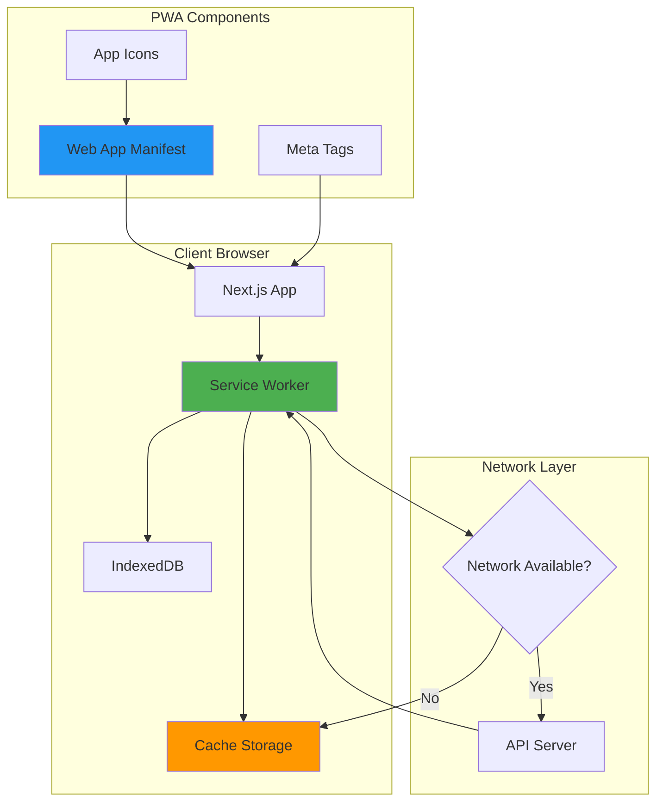
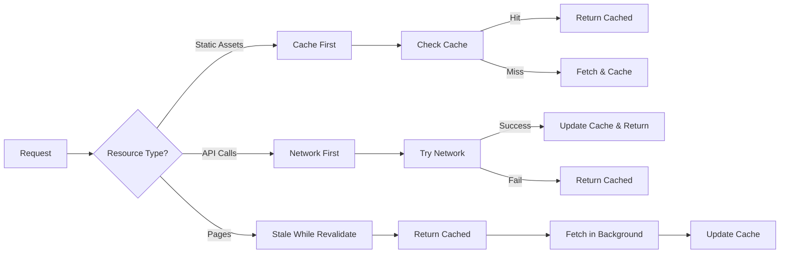

# PWA Setup Design Document

## Overview

This design document outlines the technical implementation for adding Progressive Web App (PWA) capabilities to the Financial Helm Next.js application. The solution uses the `next-pwa` package (based on Workbox) to provide a production-ready PWA implementation with minimal configuration while maintaining full control over caching strategies and offline behavior.

The PWA implementation will enable:
- Installation on Android and iOS devices
- Offline functionality with intelligent caching
- Native app-like experience in standalone mode
- Automatic updates with user notification
- Platform-specific optimizations for both Android and iOS

## Architecture

### High-Level Architecture



### Technology Stack

- **next-pwa**: v5.6.0+ - Workbox-based PWA plugin for Next.js
- **Workbox**: Underlying service worker library (bundled with next-pwa)
- **Web App Manifest**: Standard PWA manifest specification
- **Service Worker API**: Browser-native background script support

### Caching Strategy



## Components and Interfaces

### 1. Web App Manifest (`public/manifest.json`)

The manifest file defines the PWA metadata and installation behavior.

```typescript
interface WebAppManifest {
  name: string;
  short_name: string;
  description: string;
  start_url: string;
  display: 'standalone' | 'fullscreen' | 'minimal-ui' | 'browser';
  background_color: string;
  theme_color: string;
  orientation?: 'portrait' | 'landscape' | 'any';
  icons: Array<{
    src: string;
    sizes: string;
    type: string;
    purpose?: 'any' | 'maskable' | 'monochrome';
  }>;
  screenshots?: Array<{
    src: string;
    sizes: string;
    type: string;
    form_factor?: 'narrow' | 'wide';
  }>;
}
```

**Configuration Values:**
- `name`: "Financial Helm - Personal Finance Manager"
- `short_name`: "Financial Helm"
- `start_url`: "/"
- `display`: "standalone"
- `background_color`: "#ffffff"
- `theme_color`: "#1e40af" (matches brand blue)
- `orientation`: "portrait" (optimal for financial data viewing)

### 2. Next.js Configuration (`next.config.ts`)

Integration of next-pwa plugin with custom configuration.

```typescript
import withPWA from 'next-pwa';

const nextConfig = {
  // existing config
};

export default withPWA({
  dest: 'public',
  register: true,
  skipWaiting: true,
  disable: process.env.NODE_ENV === 'development',
  runtimeCaching: [
    {
      urlPattern: /^https:\/\/fonts\.(?:gstatic|googleapis)\.com\/.*/i,
      handler: 'CacheFirst',
      options: {
        cacheName: 'google-fonts',
        expiration: {
          maxEntries: 4,
          maxAgeSeconds: 365 * 24 * 60 * 60 // 1 year
        }
      }
    },
    {
      urlPattern: /^\/api\/.*/i,
      handler: 'NetworkFirst',
      options: {
        cacheName: 'api-cache',
        networkTimeoutSeconds: 10,
        expiration: {
          maxEntries: 50,
          maxAgeSeconds: 5 * 60 // 5 minutes
        }
      }
    },
    {
      urlPattern: /\.(?:jpg|jpeg|png|svg|gif|webp)$/i,
      handler: 'CacheFirst',
      options: {
        cacheName: 'image-cache',
        expiration: {
          maxEntries: 60,
          maxAgeSeconds: 30 * 24 * 60 * 60 // 30 days
        }
      }
    }
  ]
})(nextConfig);
```

### 3. Root Layout Updates (`src/app/layout.tsx`)

Enhanced metadata and PWA-specific meta tags.

```typescript
export const metadata: Metadata = {
  title: "Financial Helm - Guiding Your Personal Finances",
  description: "Take control of your finances with Financial Helm. Track expenses, manage budgets, and achieve your financial goals.",
  manifest: '/manifest.json',
  appleWebApp: {
    capable: true,
    statusBarStyle: 'default',
    title: 'Financial Helm',
  },
  formatDetection: {
    telephone: false,
  },
  icons: {
    icon: [
      { url: '/icon-192x192.png', sizes: '192x192', type: 'image/png' },
      { url: '/icon-512x512.png', sizes: '512x512', type: 'image/png' },
    ],
    apple: [
      { url: '/apple-touch-icon.png', sizes: '180x180', type: 'image/png' },
    ],
  },
};
```

Additional meta tags in the HTML head:

```tsx
<head>
  <meta name="application-name" content="Financial Helm" />
  <meta name="apple-mobile-web-app-capable" content="yes" />
  <meta name="apple-mobile-web-app-status-bar-style" content="default" />
  <meta name="apple-mobile-web-app-title" content="Financial Helm" />
  <meta name="format-detection" content="telephone=no" />
  <meta name="mobile-web-app-capable" content="yes" />
  <meta name="theme-color" content="#1e40af" />
  <link rel="apple-touch-icon" href="/apple-touch-icon.png" />
</head>
```

### 4. Service Worker Update Component

A React component to handle service worker updates and prompt users.

```typescript
// src/components/PWAUpdatePrompt.tsx
interface PWAUpdatePromptProps {
  onUpdate: () => void;
}

interface ServiceWorkerRegistration {
  waiting: ServiceWorker | null;
  update: () => Promise<void>;
}
```

Component responsibilities:
- Listen for service worker updates
- Display update notification to user
- Trigger service worker skipWaiting on user acceptance
- Reload page to activate new version

### 5. Offline Fallback Page

A dedicated offline page for when users access uncached content without connectivity.

```typescript
// src/app/offline/page.tsx
export default function OfflinePage() {
  // Display user-friendly offline message
  // Show cached data if available
  // Provide retry mechanism
}
```

## Data Models

### Icon Asset Requirements

```typescript
interface IconAsset {
  filename: string;
  size: number; // width/height in pixels
  purpose: 'any' | 'maskable' | 'apple';
  format: 'png' | 'svg';
}

const requiredIcons: IconAsset[] = [
  { filename: 'icon-192x192.png', size: 192, purpose: 'any', format: 'png' },
  { filename: 'icon-512x512.png', size: 512, purpose: 'any', format: 'png' },
  { filename: 'icon-maskable-192x192.png', size: 192, purpose: 'maskable', format: 'png' },
  { filename: 'icon-maskable-512x512.png', size: 512, purpose: 'maskable', format: 'png' },
  { filename: 'apple-touch-icon.png', size: 180, purpose: 'apple', format: 'png' },
];
```

### Cache Configuration Model

```typescript
interface CacheStrategy {
  urlPattern: RegExp;
  handler: 'CacheFirst' | 'NetworkFirst' | 'StaleWhileRevalidate' | 'NetworkOnly' | 'CacheOnly';
  options: {
    cacheName: string;
    expiration?: {
      maxEntries?: number;
      maxAgeSeconds?: number;
    };
    networkTimeoutSeconds?: number;
  };
}
```

## Error Handling

### Service Worker Registration Errors

```typescript
// Handle registration failures gracefully
if ('serviceWorker' in navigator) {
  navigator.serviceWorker.register('/sw.js')
    .then(registration => {
      console.log('SW registered:', registration);
    })
    .catch(error => {
      console.error('SW registration failed:', error);
      // App continues to work without PWA features
    });
}
```

### Offline API Request Handling

```typescript
// Network-first strategy with fallback
async function fetchWithFallback(url: string) {
  try {
    const response = await fetch(url);
    if (!response.ok) throw new Error('Network response not ok');
    return response;
  } catch (error) {
    // Try cache
    const cachedResponse = await caches.match(url);
    if (cachedResponse) return cachedResponse;
    
    // Return offline fallback
    throw new Error('Offline and no cached data available');
  }
}
```

### Update Failures

- If service worker update fails, keep existing version active
- Log errors for debugging but don't disrupt user experience
- Retry update check on next page load

## Testing Strategy

### Manual Testing Checklist

**Installation Testing:**
1. Test install prompt on Chrome Android
2. Test install prompt on Safari iOS
3. Verify home screen icon appearance
4. Verify standalone mode launch
5. Test splash screen display

**Offline Testing:**
1. Load app while online
2. Disconnect network
3. Navigate to cached pages (should work)
4. Navigate to uncached pages (should show offline page)
5. Test API calls (should return cached data or error gracefully)
6. Reconnect and verify sync

**Update Testing:**
1. Deploy new version
2. Verify update detection
3. Test update prompt display
4. Verify reload applies update
5. Check old caches are cleared

**Cross-Platform Testing:**
- Chrome on Android (latest 2 versions)
- Safari on iOS (latest 2 versions)
- Chrome on desktop (for development)
- Edge on desktop (for development)

### Automated Testing

```typescript
// Example Lighthouse CI configuration
// lighthouserc.json
{
  "ci": {
    "collect": {
      "numberOfRuns": 3,
      "url": ["http://localhost:3000"]
    },
    "assert": {
      "assertions": {
        "categories:pwa": ["error", {"minScore": 0.9}],
        "service-worker": "error",
        "installable-manifest": "error",
        "apple-touch-icon": "error",
        "themed-omnibox": "error"
      }
    }
  }
}
```

### PWA Audit Tools

- **Lighthouse**: Built into Chrome DevTools, comprehensive PWA audit
- **PWA Builder**: Online tool for testing PWA compliance
- **Chrome DevTools Application Tab**: Inspect manifest, service worker, cache storage

## Platform-Specific Considerations

### iOS Specific

- iOS requires apple-touch-icon for home screen
- Status bar styling via meta tags
- No install prompt (users must manually "Add to Home Screen")
- Limited service worker capabilities compared to Android
- Standalone mode requires specific meta tags

### Android Specific

- Supports install prompt (beforeinstallprompt event)
- Maskable icons for adaptive icon support
- Better service worker support
- Can customize install prompt timing
- Supports richer manifest features (shortcuts, share target)

### Desktop

- Install prompt available on Chrome/Edge
- Standalone window with custom title bar
- Keyboard shortcuts support
- Window controls overlay API (future enhancement)

## Security Considerations

1. **HTTPS Required**: PWA features only work over HTTPS (or localhost for development)
2. **Service Worker Scope**: Limited to same-origin requests by default
3. **Cache Poisoning**: Validate responses before caching
4. **Sensitive Data**: Don't cache authentication tokens or sensitive user data
5. **Content Security Policy**: Ensure CSP allows service worker registration

## Performance Optimizations

1. **Precaching**: Only precache essential assets to minimize initial cache size
2. **Cache Expiration**: Set appropriate expiration times for different resource types
3. **Background Sync**: Queue failed API requests for retry when online (future enhancement)
4. **Lazy Loading**: Don't cache all pages upfront, cache on-demand
5. **Compression**: Ensure assets are compressed before caching

## Future Enhancements

- **Push Notifications**: Budget alerts and financial insights
- **Background Sync**: Sync transactions when connection restored
- **Periodic Background Sync**: Fetch latest data periodically
- **Web Share API**: Share financial reports
- **Shortcuts**: Quick actions from home screen icon
- **Badging API**: Show unread notifications count on app icon
