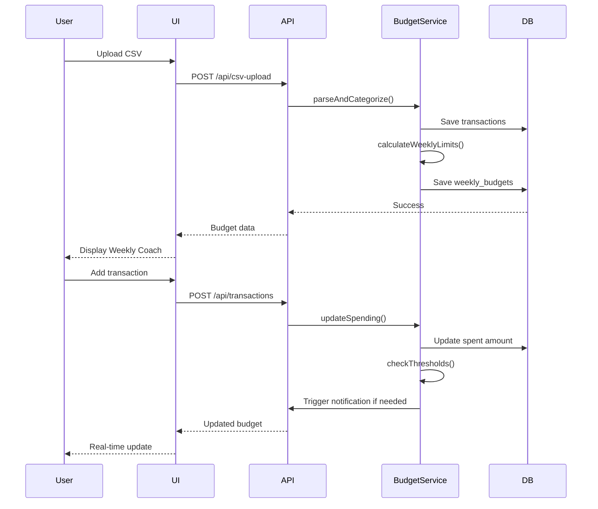

# Design Document

## Overview

The Smart Weekly Budget Coach is designed as a modular, real-time financial coaching system that transforms monthly budgets into actionable weekly spending limits. The architecture follows a layered approach with clear separation between data processing (backend), business logic (services), and presentation (UI components).

The system is built around three core concepts:
1. **Weekly Cycles**: All budget calculations operate on weekly periods (Monday-Sunday by default)
2. **Carryover Tracking**: Unspent/overspent amounts flow between weeks automatically
3. **Real-Time Updates**: All changes reflect immediately in the UI without page refreshes

This feature serves as the foundation for Financial Helm's AI-powered insights, providing the baseline data that AURA analyzes, LISA communicates, and MAIA monitors.

## Architecture

### High-Level Architecture

```
┌─────────────────────────────────────────────────────────────┐
│                         Frontend (Next.js)                   │
├─────────────────────────────────────────────────────────────┤
│  Dashboard Page                                              │
│  ├── WeeklyBudgetCoach Component                            │
│  │   ├── CategoryCard Component                             │
│  │   ├── DailySafeToSpend Component                         │
│  │   └── CustomizationModal Component                       │
│  └── CSV Upload Component                                    │
├─────────────────────────────────────────────────────────────┤
│                      State Management                        │
│  ├── Budget Store (Zustand/Context)                         │
│  ├── Transaction Store                                       │
│  └── User Preferences Store                                  │
├─────────────────────────────────────────────────────────────┤
│                      API Layer (tRPC/REST)                   │
│  ├── /api/budgets                                            │
│  ├── /api/transactions                                       │
│  ├── /api/categories                                         │
│  └── /api/csv-upload                                         │
├─────────────────────────────────────────────────────────────┤
│                      Backend Services                        │
│  ├── BudgetCalculationService                               │
│  ├── CarryoverService                                        │
│  ├── CategoryService                                         │
│  ├── CSVParserService                                        │
│  └── NotificationService                                     │
├─────────────────────────────────────────────────────────────┤
│                      Database (PostgreSQL)                   │
│  ├── users                                                   │
│  ├── transactions                                            │
│  ├── categories                                              │
│  ├── weekly_budgets                                          │
│  ├── carryovers                                              │
│  └── achievements                                            │
└─────────────────────────────────────────────────────────────┘
```

### Component Interaction Flow



## Components and Interfaces

### Frontend Components

#### 1. WeeklyBudgetCoach Component

**Purpose**: Main container component that displays all weekly budget categories

**Props**:
```typescript
interface WeeklyBudgetCoachProps {
  userId: string;
  weekStartDay?: 'monday' | 'sunday'; // default: 'monday'
  onCategoryClick?: (categoryId: string) => void;
}
```

**State**:
```typescript
interface WeeklyBudgetCoachState {
  categories: CategoryBudget[];
  loading: boolean;
  error: string | null;
  currentWeekStart: Date;
  currentWeekEnd: Date;
}
```

**Key Methods**:
- `fetchWeeklyBudgets()`: Load current week's budget data
- `refreshBudgets()`: Force refresh from server
- `handleCategoryUpdate()`: Handle real-time updates via WebSocket

#### 2. CategoryCard Component

**Purpose**: Display individual category budget with progress bar and status

**Props**:
```typescript
interface CategoryCardProps {
  category: CategoryBudget;
  onCustomize: (categoryId: string) => void;
  onExpand: (categoryId: string) => void;
  isExpanded: boolean;
}

interface CategoryBudget {
  id: string;
  name: string;
  emoji: string;
  weeklyLimit: number;
  spent: number;
  remaining: number;
  percentageUsed: number;
  status: 'good' | 'warning' | 'critical' | 'over';
  carryover: number;
  dailySafeToSpend: number;
  message: string; // Empathetic message from LISA
}
```

**Visual States**:
- **Good** (0-79%): Green progress bar, encouraging message
- **Warning** (80-89%): Yellow progress bar, gentle reminder
- **Critical** (90-99%): Orange progress bar, supportive alert
- **Over** (100%+): Red progress bar, recovery options

#### 3. DailySafeToSpend Component

**Purpose**: Show daily spending recommendation and 7-day history

**Props**:
```typescript
interface DailySafeToSpendProps {
  categoryId: string;
  weeklyRemaining: number;
  daysRemaining: number;
  last7Days: DailySpending[];
}

interface DailySpending {
  date: Date;
  amount: number;
  isOverLimit: boolean;
}
```

**Features**:
- Tap to toggle between weekly and daily view
- Bar chart showing last 7 days
- Highlight days that exceeded safe-to-spend
- Smooth animation transitions

#### 4. CustomizationModal Component

**Purpose**: Allow users to customize category settings

**Props**:
```typescript
interface CustomizationModalProps {
  category: CategoryBudget;
  onSave: (updates: CategoryUpdate) => void;
  onClose: () => void;
}

interface CategoryUpdate {
  name?: string;
  emoji?: string;
  monthlyCeiling?: number;
  isActive?: boolean;
}
```

**Fields**:
- Category name (text input)
- Emoji picker
- Monthly ceiling (currency input)
- Active toggle
- Delete button (with confirmation)

#### 5. CSVUploadComponent

**Purpose**: Handle CSV file upload and transaction review

**Props**:
```typescript
interface CSVUploadProps {
  onUploadComplete: (transactionCount: number) => void;
  onError: (error: string) => void;
}
```

**Flow**:
1. File picker (accepts .csv)
2. Parsing progress indicator
3. Transaction review table with suggested categories
4. Category editing interface
5. Confirmation and save

### Backend Services

#### 1. BudgetCalculationService

**Purpose**: Core service for calculating weekly budgets and carryovers

**Key Methods**:

```typescript
class BudgetCalculationService {
  /**
   * Calculate weekly limit for a category
   * Formula: (monthlyCeiling / weeksInMonth) - carryover ± goalAdjustments
   */
  calculateWeeklyLimit(
    categoryId: string,
    userId: string,
    weekStart: Date
  ): Promise<number>;

  /**
   * Calculate monthly ceiling based on historical average
   * Uses last 3 months of data
   */
  calculateMonthlyCeiling(
    categoryId: string,
    userId: string
  ): Promise<number>;

  /**
   * Update spent amount for current week
   */
  updateWeeklySpending(
    categoryId: string,
    userId: string,
    amount: number,
    transactionDate: Date
  ): Promise<void>;

  /**
   * Calculate carryover from previous week
   * Positive if under budget, negative if over
   */
  calculateCarryover(
    categoryId: string,
    userId: string,
    weekStart: Date
  ): Promise<number>;

  /**
   * Get current week's budget status
   */
  getWeeklyBudgetStatus(
    userId: string,
    weekStart: Date
  ): Promise<CategoryBudget[]>;

  /**
   * Check if thresholds are crossed (80%, 90%, 100%)
   */
  checkThresholds(
    categoryId: string,
    userId: string
  ): Promise<ThresholdAlert | null>;
}
```

#### 2. CarryoverService

**Purpose**: Manage carryover calculations and tracking

**Key Methods**:

```typescript
class CarryoverService {
  /**
   * Apply carryover to new week
   */
  applyCarryover(
    categoryId: string,
    userId: string,
    fromWeek: Date,
    toWeek: Date
  ): Promise<void>;

  /**
   * Get carryover history for a category
   */
  getCarryoverHistory(
    categoryId: string,
    userId: string,
    weeks: number
  ): Promise<CarryoverRecord[]>;

  /**
   * Trigger micro-recovery plan for negative carryover
   */
  triggerRecoveryPlan(
    categoryId: string,
    userId: string,
    deficit: number
  ): Promise<RecoveryPlan>;
}
```

#### 3. CategoryService

**Purpose**: Manage category CRUD operations and auto-categorization

**Key Methods**:

```typescript
class CategoryService {
  /**
   * Auto-categorize transaction based on description
   * Uses pattern matching and ML
   */
  suggestCategory(description: string): Promise<string>;

  /**
   * Get all active categories for user
   */
  getActiveCategories(userId: string): Promise<Category[]>;

  /**
   * Create custom category
   */
  createCategory(
    userId: string,
    category: CategoryCreate
  ): Promise<Category>;

  /**
   * Update category settings
   */
  updateCategory(
    categoryId: string,
    updates: CategoryUpdate
  ): Promise<Category>;

  /**
   * Archive category (soft delete)
   */
  archiveCategory(categoryId: string): Promise<void>;
}
```

#### 4. CSVParserService

**Purpose**: Parse and validate CSV files

**Key Methods**:

```typescript
class CSVParserService {
  /**
   * Parse CSV file and extract transactions
   * Supports multiple bank formats
   */
  parseCSV(file: File): Promise<ParsedTransaction[]>;

  /**
   * Validate CSV format
   */
  validateCSV(file: File): Promise<ValidationResult>;

  /**
   * Detect CSV format (bank-specific)
   */
  detectFormat(file: File): Promise<BankFormat>;

  /**
   * Check for duplicate transactions
   */
  checkDuplicates(
    transactions: ParsedTransaction[],
    userId: string
  ): Promise<DuplicateCheck>;
}
```

## Data Models

### Database Schema

#### users table
```sql
CREATE TABLE users (
  id UUID PRIMARY KEY DEFAULT gen_random_uuid(),
  email VARCHAR(255) UNIQUE NOT NULL,
  name VARCHAR(255),
  week_start_day VARCHAR(10) DEFAULT 'monday',
  currency VARCHAR(3) DEFAULT 'USD',
  created_at TIMESTAMP DEFAULT NOW(),
  updated_at TIMESTAMP DEFAULT NOW()
);
```

#### categories table
```sql
CREATE TABLE categories (
  id UUID PRIMARY KEY DEFAULT gen_random_uuid(),
  user_id UUID REFERENCES users(id) ON DELETE CASCADE,
  name VARCHAR(100) NOT NULL,
  emoji VARCHAR(10) DEFAULT '📊',
  monthly_ceiling DECIMAL(10, 2),
  is_active BOOLEAN DEFAULT true,
  is_custom BOOLEAN DEFAULT false,
  created_at TIMESTAMP DEFAULT NOW(),
  updated_at TIMESTAMP DEFAULT NOW(),
  UNIQUE(user_id, name)
);

CREATE INDEX idx_categories_user_active ON categories(user_id, is_active);
```

#### transactions table
```sql
CREATE TABLE transactions (
  id UUID PRIMARY KEY DEFAULT gen_random_uuid(),
  user_id UUID REFERENCES users(id) ON DELETE CASCADE,
  category_id UUID REFERENCES categories(id),
  date DATE NOT NULL,
  description TEXT NOT NULL,
  amount DECIMAL(10, 2) NOT NULL,
  type VARCHAR(10) CHECK (type IN ('income', 'expense')),
  notes TEXT,
  source VARCHAR(20) DEFAULT 'manual', -- 'manual', 'csv', 'api'
  created_at TIMESTAMP DEFAULT NOW(),
  updated_at TIMESTAMP DEFAULT NOW()
);

CREATE INDEX idx_transactions_user_date ON transactions(user_id, date DESC);
CREATE INDEX idx_transactions_category ON transactions(category_id);
```

#### weekly_budgets table
```sql
CREATE TABLE weekly_budgets (
  id UUID PRIMARY KEY DEFAULT gen_random_uuid(),
  user_id UUID REFERENCES users(id) ON DELETE CASCADE,
  category_id UUID REFERENCES categories(id) ON DELETE CASCADE,
  week_start DATE NOT NULL,
  week_end DATE NOT NULL,
  weekly_limit DECIMAL(10, 2) NOT NULL,
  spent DECIMAL(10, 2) DEFAULT 0,
  carryover DECIMAL(10, 2) DEFAULT 0,
  status VARCHAR(20) DEFAULT 'active',
  created_at TIMESTAMP DEFAULT NOW(),
  updated_at TIMESTAMP DEFAULT NOW(),
  UNIQUE(user_id, category_id, week_start)
);

CREATE INDEX idx_weekly_budgets_user_week ON weekly_budgets(user_id, week_start);
CREATE INDEX idx_weekly_budgets_category ON weekly_budgets(category_id);
```

#### carryovers table
```sql
CREATE TABLE carryovers (
  id UUID PRIMARY KEY DEFAULT gen_random_uuid(),
  user_id UUID REFERENCES users(id) ON DELETE CASCADE,
  category_id UUID REFERENCES categories(id) ON DELETE CASCADE,
  from_week DATE NOT NULL,
  to_week DATE NOT NULL,
  amount DECIMAL(10, 2) NOT NULL,
  type VARCHAR(10) CHECK (type IN ('positive', 'negative')),
  applied BOOLEAN DEFAULT false,
  created_at TIMESTAMP DEFAULT NOW()
);

CREATE INDEX idx_carryovers_user_category ON carryovers(user_id, category_id);
```

#### achievements table
```sql
CREATE TABLE achievements (
  id UUID PRIMARY KEY DEFAULT gen_random_uuid(),
  user_id UUID REFERENCES users(id) ON DELETE CASCADE,
  category_id UUID REFERENCES categories(id),
  type VARCHAR(50) NOT NULL, -- 'four_week_streak', 'budget_master', etc.
  weeks_count INTEGER,
  surplus_amount DECIMAL(10, 2),
  achieved_at TIMESTAMP DEFAULT NOW(),
  acknowledged BOOLEAN DEFAULT false
);

CREATE INDEX idx_achievements_user ON achievements(user_id, achieved_at DESC);
```

### TypeScript Interfaces

```typescript
// Core types
interface User {
  id: string;
  email: string;
  name: string;
  weekStartDay: 'monday' | 'tuesday' | 'wednesday' | 'thursday' | 'friday' | 'saturday' | 'sunday';
  currency: string;
  createdAt: Date;
  updatedAt: Date;
}

interface Category {
  id: string;
  userId: string;
  name: string;
  emoji: string;
  monthlyCeiling: number;
  isActive: boolean;
  isCustom: boolean;
  createdAt: Date;
  updatedAt: Date;
}

interface Transaction {
  id: string;
  userId: string;
  categoryId: string;
  date: Date;
  description: string;
  amount: number;
  type: 'income' | 'expense';
  notes?: string;
  source: 'manual' | 'csv' | 'api';
  createdAt: Date;
  updatedAt: Date;
}

interface WeeklyBudget {
  id: string;
  userId: string;
  categoryId: string;
  weekStart: Date;
  weekEnd: Date;
  weeklyLimit: number;
  spent: number;
  carryover: number;
  status: 'active' | 'completed' | 'archived';
  createdAt: Date;
  updatedAt: Date;
}

interface Carryover {
  id: string;
  userId: string;
  categoryId: string;
  fromWeek: Date;
  toWeek: Date;
  amount: number;
  type: 'positive' | 'negative';
  applied: boolean;
  createdAt: Date;
}

interface Achievement {
  id: string;
  userId: string;
  categoryId?: string;
  type: string;
  weeksCount?: number;
  surplusAmount?: number;
  achievedAt: Date;
  acknowledged: boolean;
}

// Computed types
interface CategoryBudget {
  id: string;
  name: string;
  emoji: string;
  weeklyLimit: number;
  spent: number;
  remaining: number;
  percentageUsed: number;
  status: 'good' | 'warning' | 'critical' | 'over';
  carryover: number;
  dailySafeToSpend: number;
  message: string;
  lastUpdated: Date;
}

interface RecoveryPlan {
  categoryId: string;
  deficit: number;
  options: RecoveryOption[];
}

interface RecoveryOption {
  id: string;
  title: string;
  description: string;
  impact: string;
  action: () => Promise<void>;
}

interface ThresholdAlert {
  categoryId: string;
  threshold: 80 | 90 | 100;
  message: string;
  severity: 'info' | 'warning' | 'critical';
}
```

## Error Handling

### Error Types

```typescript
enum BudgetErrorCode {
  INSUFFICIENT_DATA = 'INSUFFICIENT_DATA',
  INVALID_CSV = 'INVALID_CSV',
  DUPLICATE_TRANSACTION = 'DUPLICATE_TRANSACTION',
  CATEGORY_NOT_FOUND = 'CATEGORY_NOT_FOUND',
  CALCULATION_ERROR = 'CALCULATION_ERROR',
  DATABASE_ERROR = 'DATABASE_ERROR',
  VALIDATION_ERROR = 'VALIDATION_ERROR',
}

class BudgetError extends Error {
  constructor(
    public code: BudgetErrorCode,
    message: string,
    public details?: any
  ) {
    super(message);
    this.name = 'BudgetError';
  }
}
```

### Error Handling Strategy

1. **CSV Upload Errors**:
   - Invalid format → Show format guide with examples
   - Duplicate transactions → Highlight duplicates, allow user to skip
   - Missing required fields → Show which fields are missing

2. **Calculation Errors**:
   - Insufficient data → Show notice, use available data
   - Negative limits → Set to zero, suggest adjustments
   - Database errors → Retry with exponential backoff

3. **UI Errors**:
   - Network failures → Show offline mode, queue updates
   - Timeout → Show loading state, allow cancel
   - Validation errors → Inline field-level errors

### User-Friendly Error Messages

```typescript
const ERROR_MESSAGES = {
  [BudgetErrorCode.INSUFFICIENT_DATA]: 
    "We need at least 4 weeks of data to calculate accurate budgets. Keep adding transactions and we'll improve over time! 📈",
  
  [BudgetErrorCode.INVALID_CSV]: 
    "This CSV format isn't quite right. Can you check if it has columns for date, description, and amount? 📄",
  
  [BudgetErrorCode.DUPLICATE_TRANSACTION]: 
    "Looks like we've seen some of these transactions before. Want to skip the duplicates? 🔄",
  
  [BudgetErrorCode.CATEGORY_NOT_FOUND]: 
    "Hmm, we can't find that category. Let's create it together! ✨",
};
```

## Testing Strategy

### Unit Tests

**BudgetCalculationService**:
- Test weekly limit calculation with various scenarios
- Test carryover calculations (positive and negative)
- Test threshold detection (80%, 90%, 100%)
- Test edge cases (zero spending, first week, last day)

**CarryoverService**:
- Test carryover application between weeks
- Test recovery plan generation
- Test multi-week carryover tracking

**CategoryService**:
- Test auto-categorization accuracy
- Test category CRUD operations
- Test duplicate detection

**CSVParserService**:
- Test parsing various CSV formats
- Test validation logic
- Test duplicate detection
- Test error handling

### Integration Tests

**CSV Upload Flow**:
1. Upload valid CSV → Verify transactions saved
2. Upload with duplicates → Verify duplicate handling
3. Upload invalid format → Verify error message

**Budget Calculation Flow**:
1. Add transactions → Verify weekly budget updates
2. Cross week boundary → Verify carryover applied
3. Exceed limit → Verify threshold alert triggered

**Real-Time Updates**:
1. Add transaction → Verify UI updates within 1 second
2. Multiple rapid updates → Verify no race conditions
3. Offline mode → Verify queue and sync on reconnect

### End-to-End Tests

**Complete User Journey**:
1. New user uploads first CSV
2. System calculates initial budgets
3. User adds manual transaction
4. Budget updates in real-time
5. User customizes category
6. Week rolls over, carryover applied
7. User achieves 4-week streak
8. Achievement notification shown

### Performance Tests

- CSV parsing: 10,000 transactions in <3 seconds
- Weekly limit calculation: <500ms for 20 categories
- Real-time update: <1 second from transaction to UI
- Database queries: <100ms for budget status
- Concurrent users: Support 1000+ simultaneous users

## Security Considerations

1. **Data Privacy**:
   - All financial data encrypted at rest
   - User data isolated by user_id
   - No cross-user data leakage

2. **Input Validation**:
   - Sanitize all CSV inputs
   - Validate currency amounts (no negative budgets)
   - Prevent SQL injection in queries

3. **Authentication**:
   - JWT tokens for API access
   - Session management
   - Rate limiting on uploads

4. **Authorization**:
   - Users can only access their own data
   - Row-level security in database
   - API endpoint protection

## Performance Optimization

1. **Database**:
   - Indexes on frequently queried columns
   - Materialized views for complex calculations
   - Connection pooling

2. **Caching**:
   - Cache weekly budgets (5-minute TTL)
   - Cache category lists (1-hour TTL)
   - Invalidate on updates

3. **Frontend**:
   - Optimistic UI updates
   - Debounce rapid updates
   - Virtual scrolling for long lists
   - Code splitting for modals

4. **Real-Time**:
   - WebSocket for live updates
   - Batch updates every 2 seconds
   - Fallback to polling if WebSocket fails

## Accessibility

1. **Keyboard Navigation**:
   - Tab through all interactive elements
   - Enter to expand/collapse cards
   - Escape to close modals

2. **Screen Readers**:
   - ARIA labels on all components
   - Announce budget status changes
   - Describe progress bar percentages

3. **Visual**:
   - High contrast mode support
   - Color-blind friendly palette
   - Text alternatives for emojis
   - Minimum 16px font size

4. **Mobile**:
   - Touch targets ≥44px
   - Swipe gestures for navigation
   - Responsive design for all screens
